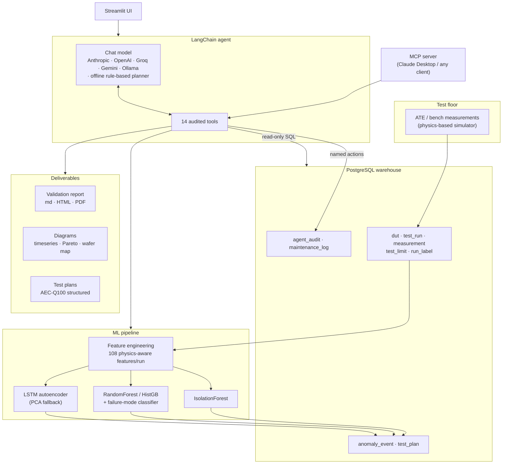
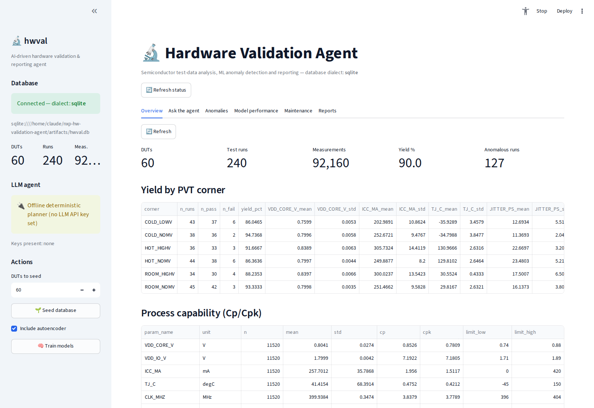
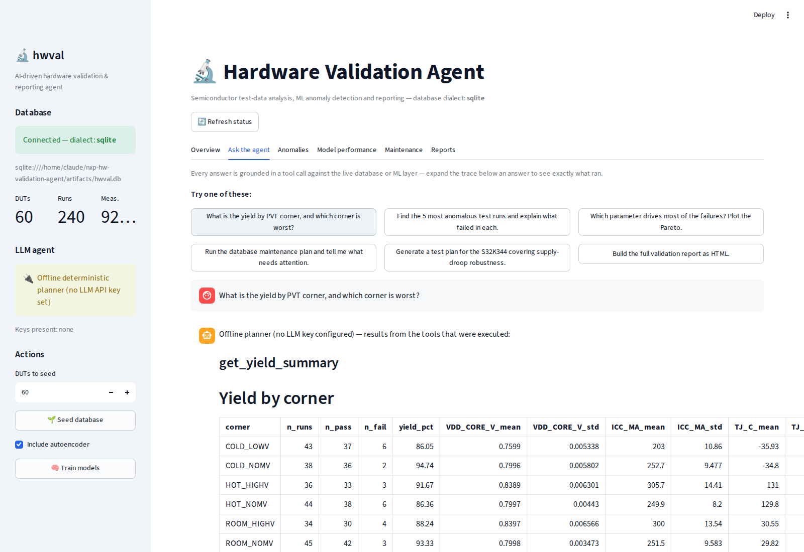
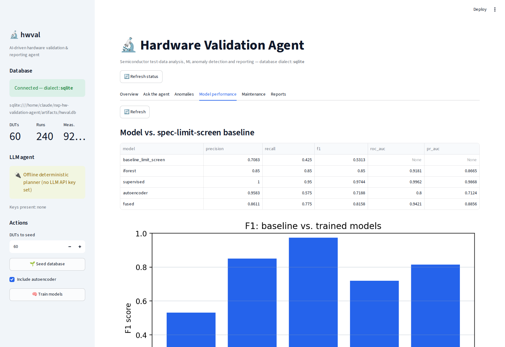
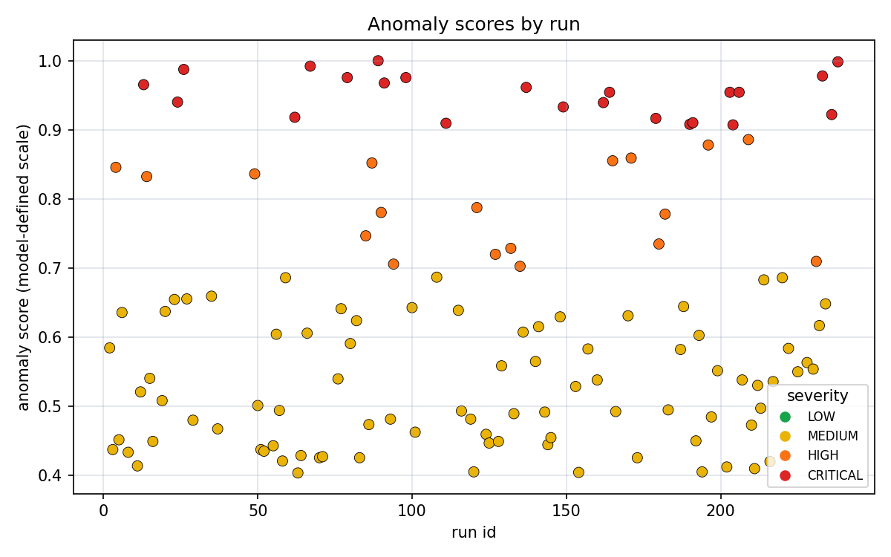
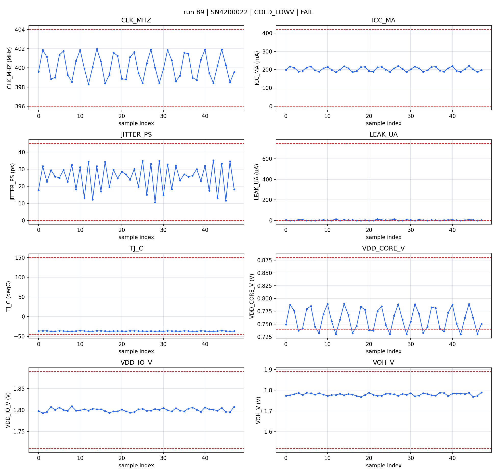

# AI-Driven Hardware Validation & Reporting Agent

An autonomous GenAI agent that turns raw silicon validation measurements into
answers, anomaly findings, diagrams, reports and test plans - and keeps its own
PostgreSQL database healthy while doing it.

Built end-to-end: physics-grounded data generator → PostgreSQL warehouse →
feature/ML pipeline (scikit-learn + TensorFlow) → LangChain tool-calling agent →
MCP server → Streamlit demo UI → Docker/CI/deployment.

> **Runs with no API key.** When no LLM credential is present the agent falls
> back to a deterministic rule-based planner that implements the same
> `BaseChatModel` interface, so the demo — and the CI suite — execute the *same*
> agent graph at zero cost. Add `ANTHROPIC_API_KEY` (or OpenAI / Groq / Gemini /
> Ollama) and the reasoning upgrades without a code change.

---

## Headline result

The question the project answers: **does an ML anomaly model actually beat the
spec-limit screen a validation lab already has?**

| Detector | Precision | Recall | F1 | ROC-AUC | PR-AUC |
|---|---|---|---|---|---|
| Spec-limit screen (today's baseline) | 0.708 | 0.425 | **0.531** | – | – |
| IsolationForest (unsupervised) | 0.850 | 0.850 | 0.850 | 0.918 | 0.867 |
| LSTM autoencoder (semi-supervised) | 0.958 | 0.575 | 0.719 | 0.800 | 0.712 |
| Rank-fused ensemble | 0.861 | 0.775 | 0.816 | 0.942 | 0.886 |
| **Supervised RF — held-out, grouped by DUT** | **1.000** | **0.818** | **0.900** | **0.963** | **0.917** |

240 runs / 40 injected faults / 92,160 measurements. The held-out row is the
honest number: the train/test split is grouped by device serial, so no die
appears on both sides.

Two counts matter more to a lab than F1:

* **14 test escapes recovered** — runs with a real injected defect that passed
  every spec limit, caught by the model. These are the parts that ship and come
  back as field returns.
* **3 overkill runs avoided** — runs the limit screen failed because of an ATE
  contact glitch, which the model correctly called healthy.

Honest caveat, and a good interview question: the *fused* score is worse than the
supervised model alone (0.816 vs 0.900). Rank-averaging drags a strong learner
toward two weaker ones. Fusion is kept as the cold-start path for a new product
with no failure-analysis labels yet; once labels exist, the supervised score is
the one to deploy. That result is reported rather than hidden.

---

## What it does



**Ask it a question, it plans and executes:**

```console
$ hwval ask "Which corner has the worst yield, and what is failing there?"
```

The agent selects `get_yield_summary`, then `query_measurements`, then a
targeted `run_sql_query`, and answers from the returned rows. On the reference
campaign shipped with this repo those rows are:

| corner | runs | pass | yield |
|---|---|---|---|
| COLD_LOWV | 43 | 37 | 86.0 % |
| HOT_NOMV | 44 | 38 | 86.4 % |
| ROOM_HIGHV | 34 | 30 | 88.2 % |
| HOT_HIGHV | 36 | 33 | 91.7 % |
| ROOM_NOMV | 45 | 42 | 93.3 % |
| COLD_NOMV | 38 | 36 | 94.7 % |

with `JITTER_PS` the dominant out-of-limit parameter (96 samples, 59 of them in
`HOT_NOMV`), followed by `LEAK_UA` (83) — the two parameters the device model
couples through junction temperature. Every figure in this README comes from a
tool result; nothing here is typed by hand.

---

## Screenshots

| Demo UI — campaign overview | Agent answering with a live tool trace |
|---|---|
|  |  |

| Model vs limit-screen comparison | Anomaly score distribution |
|---|---|
|  |  |

A single anomalous run, spec limits drawn in — this is `run 89`, an `ldo_ripple`
fault the models rank most severe in the campaign:



---

## Mapping to the NXP Validation Innovation Team brief

| Job requirement | Where it lives |
|---|---|
| Automate test measurements, data processing, report generation | `hwval.db.seed`, `hwval.reporting.report` — one command produces a full md/HTML/PDF report with tables, figures and a SQL traceability appendix |
| Automated data tables, diagrams and reports using GenAI | `hwval.reporting.{tables,plots}` + agent tools `get_yield_summary`, `create_plot`, `build_report` |
| Maintenance agent for a PostgreSQL database | `hwval.db.maintenance` — table stats, bloat/vacuum, index advisor, integrity checks, retention purge, partition advisor; dry-run by default, every action logged |
| Automated test-plan generation using LLMs | `hwval.reporting.testplan` — DB-grounded AEC-Q100 plan, LLM-authored with deterministic fallback |
| scikit-learn / TensorFlow / Keras | `hwval.ml.train_sklearn`, `hwval.ml.train_tf` |
| LangChain, LLMs, prompt engineering, agents, MCP tools | `hwval.agent.*` (LangChain 1.x `create_agent`, prompt design in `prompts.py`), `hwval.mcp_server` (12 tools, 3 resources, 1 prompt) |
| Solid SQL / efficient queries | Narrow-fact schema with composite indexes, set-based aggregation in `hwval.ml.features`, index advisor, partitioning plan |
| Python, debugging, code review | 6.1k LOC, 97 tests, ruff-clean, typed, CI on every push |
| Security-conscious way of working | Read-only SQL guard, identifier whitelisting, no LLM-authored DDL/DML, full audit trail in `agent_audit` |

---

## Quickstart

```bash
git clone <this repo> && cd nxp-hw-validation-agent
make install                     # or: pip install -e ".[dev,tf,llm]"

# zero-infrastructure demo (SQLite, no API key)
export DATABASE_URL="sqlite:///./hwval.db"
make demo                        # seed -> train -> score -> evaluate -> report -> 3 agent questions

make ui                          # Streamlit demo at http://localhost:8501
```

With Postgres:

```bash
cp .env.example .env             # set DATABASE_URL, optionally an LLM key
make docker-up                   # postgres:16 + app
```

Individual steps:

```bash
hwval seed --duts 60             # generate a validation campaign
hwval train                      # sklearn + LSTM autoencoder
hwval evaluate                   # model vs limit-screen comparison
hwval report --fmt html          # self-contained report
hwval testplan --product S32K344 --requirements "supply-droop robustness"
hwval maintain                   # DB maintenance plan (dry run)
hwval ask "find the 5 most anomalous runs"
```

MCP server (Claude Desktop, IDEs, other agents):

```bash
python -m hwval.mcp_server.server            # stdio
python -m hwval.mcp_server.server --http 8765
```

---

## Design decisions worth defending

**The LLM never writes DDL or DML.** `run_sql_query` accepts a single
`SELECT`/`WITH` statement, blacklists mutating keywords and clamps a `LIMIT`.
Everything that changes state is a named, parameterised action in
`hwval.db.maintenance` with an identifier whitelist. The model chooses *which*
audited action to call — it never composes the SQL that runs it.

**Every tool call is logged.** `agent_audit` records tool name, arguments,
latency, status and a result preview; `maintenance_log` records every
maintenance action and whether it was a dry run. A number in a generated report
can be traced back to the query that produced it, which is the minimum bar for
an agent operating anywhere near a certified process.

**The failure labels live in their own table.** `run_label` is written by the
"FA lab", never joined into the feature builder. Train/serve skew from a label
leaking into the feature set is the single most common way a project like this
silently fails.

**Split by device, not by row.** 48 samples from one die are not 48 independent
observations. A random split reports a fantasy score; `GroupShuffleSplit` on the
DUT serial reports the real one.

**The data generator is a device model, not noise.** Leakage doubles every 15 K,
junction temperature follows `T_amb + Rth·P`, and the loop is iterated to a
fixed point — so a supply droop really does produce a current rise, a
temperature rise and a jitter rise. The correlation structure the detector
exploits exists because the physics put it there.

**Degradation is designed in.** No TensorFlow → PCA-reconstruction autoencoder
with the same interface. No PDF engine → HTML. No LLM key → deterministic
planner. No Postgres → SQLite. Each fallback is announced, never silent.

---

## Repository layout

```
src/hwval/
  config.py            env-driven settings (Postgres / SQLite / LLM / paths)
  cli.py               one CLI for the whole pipeline
  db/
    models.py          SQLAlchemy schema (8 tables + audit tables)
    seed.py            electro-thermal device simulator with injected faults
    maintenance.py     the PostgreSQL maintenance agent
    engine.py          engine/session factory, health check
  ml/
    features.py        per-run feature engineering (physics-aware)
    train_sklearn.py   IsolationForest + supervised model selection + failure-mode classifier
    train_tf.py        LSTM autoencoder (TensorFlow) / PCA fallback
    predict.py         scoring, score fusion, severity, top-feature attribution
    evaluate.py        baseline-vs-model comparison, escapes and overkill
  reporting/
    plots.py           6 diagram types, spec limits drawn in
    tables.py          yield summary, Cp/Cpk capability
    report.py          md / self-contained HTML / PDF assembly
    testplan.py        AEC-Q100 test-plan generation
  agent/
    llm.py             provider-agnostic factory + offline RuleBasedChatModel
    tools.py           14 audited LangChain tools, SQL guard
    prompts.py         system prompt and prompt-engineering rationale
    core.py            agent graph assembly and invocation
  mcp_server/server.py MCP tools, resources and prompt templates
app/streamlit_app.py   6-tab demo UI
tests/                 97 tests: unit, integration, agent, MCP, CLI
docs/                  ARCHITECTURE · DEPLOY · INTERVIEW · INTERFACES
```

---

## Testing and CI

```bash
make test        # 97 tests, SQLite, no network, TensorFlow optional
make lint        # ruff
```

GitHub Actions runs the suite on every push plus a second job against a real
`postgres:16` service container (`init` → `seed` → `maintain` → `evaluate`) so
the Postgres-specific catalogue queries are exercised, not just the SQLite path.

## Limitations

* Measurements are simulated. The device model is defensible but it is a model;
  on real silicon the feature set would need re-validation against FA findings.
* 240 runs is a small campaign. The confidence intervals on the reported F1 are
  wide — the ranking of methods is the result, not the third decimal place.
* The autoencoder is trained on 200 nominal sequences. That is enough to show
  the method, not enough to deploy it.
* The offline planner routes on keywords. It demonstrates the plumbing; the
  reasoning quality with a real model is a different thing entirely.

## Licence

MIT.

## Sample output

Committed under [`samples/`](samples/) so the deliverables can be read without
running anything: a full validation report, a generated AEC-Q100 test plan, and
the raw model-evaluation JSON behind the results table above.
