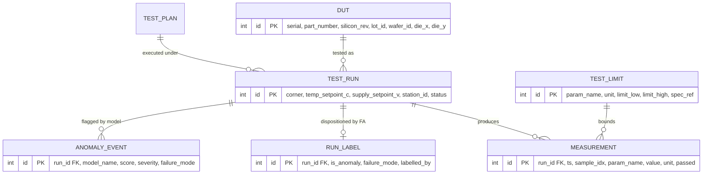
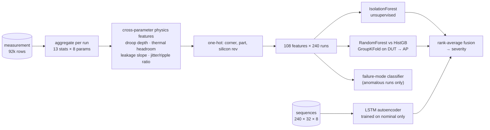
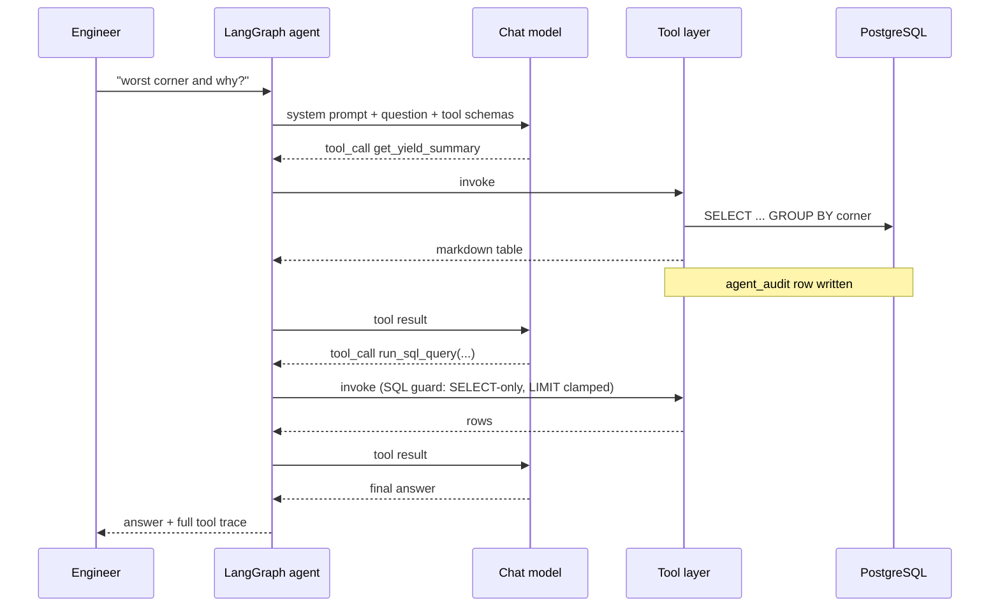

# Architecture

## 1. Data model



Plus two operational tables that make the agent auditable: `agent_audit` (one
row per tool call) and `maintenance_log` (one row per maintenance action).

**Why `measurement` is narrow (EAV-ish) rather than one column per parameter.**
The parameter set differs per test plan and per silicon revision. A wide table
makes adding a parameter a schema migration and leaves the table sparse across
revisions. Narrow costs an extra join and more rows, which is paid back by
composite indexes `(run_id, param_name, sample_idx)` and `(param_name, ts)` and,
at real volume, by monthly range partitioning on `ts` (`partition_advisor` emits
the DDL). At 92k rows the difference is academic; at 10⁹ rows it is the design.

**Why the label lives in `run_label`.** The supervised model must never see the
target through a feature. Keeping the disposition in its own table means the
feature builder physically cannot join it in by accident, and it mirrors how a
real lab works — the label arrives days later from failure analysis, not from the
tester.

## 2. Data generation (`hwval.db.seed`)

A small electro-thermal device model, iterated to a fixed point per sample:

```
P_dyn  = VDD_CORE · ICC
T_j    = T_amb + Rth_ja · P_dyn          Rth_ja = 22 °C/W
I_leak = I0 · 2^((T_j − 25)/15)          IDDQ doubles ≈ every 15 K
ICC    = ICC_dyn(VDD) + I_leak
jitter = j0 · (1 + a·(T_j − 25)) · (1 + b·ripple/VDD)
```

Five injected failure modes perturb the *inputs* to that loop, so the observable
correlations are consequences rather than decorations:

| Mode | Physical story | Primary signature |
|---|---|---|
| `vdd_droop` | IR drop / LDO current limit under load | negative VDD_CORE slope, ICC rise |
| `thermal_runaway` | degraded thermal path | superlinear T_j ramp, leakage blow-up |
| `ldo_ripple` | regulator loop instability | VDD ripple amplitude, jitter multiplication |
| `clock_jitter_drift` | PLL loop-filter degradation | monotonic jitter ramp |
| `iddq_leakage_shift` | gate-oxide / bridging defect | step change in IDDQ |

A sixth perturbation, the **ATE glitch**, is deliberately *not* a device defect:
a single-sample spike that trips a hard limit on a healthy part. It is what
creates the overkill the model is supposed to reject.

## 3. ML pipeline



Three deliberate choices:

1. **Grouped splits everywhere.** `GroupShuffleSplit` / `GroupKFold` on the DUT
   serial. Samples within a die are not independent; a row-wise split inflates
   every metric.
2. **The autoencoder trains on nominal runs only.** That is what makes it
   semi-supervised novelty detection rather than an identity function that
   learns to reconstruct the faults too.
3. **Model selection is by average precision, not accuracy.** 40/240 positives;
   accuracy rewards predicting "nominal" forever.

Attribution: `top_features` reports the three features furthest from the nominal
mean in z-score terms, computed against statistics frozen at training time.
Cheaper than per-row SHAP and stable enough to put in a report — the trade-off
is documented in `predict.py` rather than hidden.

## 4. Agent



`langchain.agents.create_agent` compiles this to a LangGraph state machine, so
the iteration bound is enforced by the graph (`recursion_limit`), not by asking
the model nicely.

### The security boundary

| Layer | Rule |
|---|---|
| SQL | single statement; `SELECT`/`WITH` only; mutating keywords rejected; `LIMIT` injected when absent |
| Identifiers | table names checked against `ALL_TABLES` — the only defence that works when an identifier must be interpolated |
| State changes | named parameterised actions only; `dry_run=True` by default |
| Destructive actions | the prompt requires the model to propose, not execute, without explicit user consent |
| Observability | `agent_audit` + `maintenance_log`, including failures |

### The offline planner

`RuleBasedChatModel` is a full `BaseChatModel`: it implements `bind_tools` and
emits real `tool_calls`, so the graph, the tool layer, the audit trail and the
answer-rendering path are all identical to a run with a frontier model. Only the
selection policy changes — regex routing instead of reasoning. That is what lets
CI test the agent end to end with no credentials and no network.

## 5. Reporting

`build_validation_report` assembles metadata, executive summary, yield and
Cp/Cpk tables, six figures, anomaly findings and — importantly — an appendix
containing the exact SQL that produced each section. HTML output embeds figures
as base64 data URIs so a single file can be mailed. PDF degrades weasyprint →
wkhtmltopdf → matplotlib → HTML with a logged warning; a validation report never
fails to build because a rendering engine is missing.

## 6. Maintenance agent

| Action | Postgres | SQLite fallback |
|---|---|---|
| `table_stats` | `pg_stat_user_tables` (live/dead tuples, bloat %) | `COUNT(*)` per table |
| `index_advisor` | unused indexes from `pg_stat_user_indexes`; seq-scan hotspots | reports unsupported |
| `integrity_check` | domain checks (orphans, pass-flag vs limits, missing labels) | identical |
| `long_running_transactions` | `pg_stat_activity` | reports unsupported |
| `vacuum_analyze` | `VACUUM (ANALYZE)`, autocommit, `FULL` never default | `VACUUM` / `ANALYZE` |
| `reindex` | `REINDEX ... CONCURRENTLY` | `REINDEX` |
| `retention_purge` | measurement rows older than N days | identical |
| `partition_advisor` | emits monthly range-partitioning DDL | identical |

`run_maintenance_plan` chains them: inspect, vacuum what the inspection found
bloated, verify integrity, advise on indexes and partitioning, and *propose* the
retention purge. The purge is never executed silently — data loss is not a thing
an autonomous agent should be able to do by inference.

## 7. Deployment

Three targets, one image: docker-compose (Postgres + app + optional MCP over
HTTP), Streamlit Community Cloud + Neon Postgres, and HuggingFace Spaces. See
[DEPLOY.md](DEPLOY.md). On Streamlit Cloud TensorFlow is deliberately excluded
from `requirements.txt` — the PCA autoencoder fallback keeps the demo inside the
free tier's memory budget.
